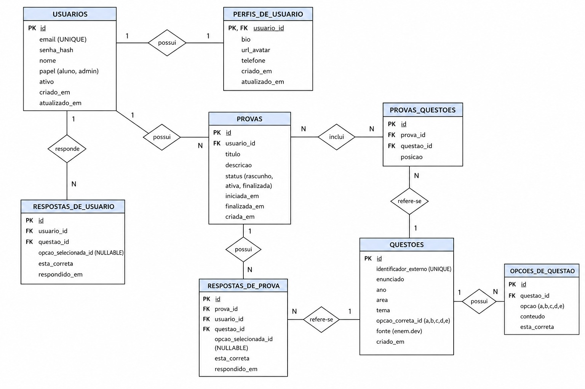

# EstudaENEM
## Visão Geral do Projeto

### Problema que a API resolve

A plataforma EstudaENEM foi pensada para ajudar alunos que têm dificuldade em estudar para o ENEM e recorrem a alternativas gratuitas. Muitos estudantes acabam se perdendo em apostilas extensas e em questões dispersas em diferentes fontes.

A proposta da ferramenta é centralizar a resolução de questões antigas do ENEM em uma única aplicação, permitindo correção imediata. Caso o estudante erre, a plataforma apresenta uma explicação breve com a alternativa correta.

Embora existam outras plataformas de estudos, a EstudaENEM se diferencia por permitir a realização de uma prova completa do ENEM, o que contribui para a sua usabilidade.

### Público-alvo

Alunos do ensino médio que procuram serviços gratuitos.

### Principais funcionalidades

- Cadastro de usuários, incluindo alteração de dados;
- Escolha do ano e do dia da prova;
- Ao final da resolução, visualização do tempo gasto para responder às questões;
- Exibição de um ranking semanal com os alunos que acertaram mais questões;
- Escolha das áreas de conhecimento das questões.

## Modelagem de dados


## Estrutura do Projeto
Estrutura de páginas do projeto:
```bash
estudaenem/
 |_ backend/
    |_ src/                                                # Todo o código estará contido nessa pasta
        |_ app/                                            # Pasta para rotas da aplicação
            |_ auth/                                       # Rotas de autenticação
            |_ home/                                       # Página inicial
            |_ api.py
        |_ models/                                         # Modelo do banco de dados
        |_ main.py
    |_ .env
    |_ README.md                                           # Visão geral do backend e como rodar o projeto
    |_ requirements.txt                                    # Dependências do projeto
 
 |_ frontend/
    |_ estuda-enem-app/
        |_ node_modules/
        |_ public/
        |_ src/
            |_ assets/                                         # Imagens
            |_ components/                                     # Componentes reutilizáveis
            |_ features/                                       # Funcionalidades específicas da aplicação
            |_ services/                                       # Serviços da API
            |_ pages/                                          # Páginas principais da aplicação
            |_ styles/                                         # Estilos globais
            |_ utils/                                          # Funções auxiliares
            |_ App.jsx
    |_ .env
    |_ package.json
    |_ README.md                                           # Visão geral do frontend e como rodar

```

## Definição dos Endpoints
| Método (nome)                 | Rota                                             | Descrição |
|-------------------------------|--------------------------------------------------|-----------|
| register                      | `POST /auth/register`                            | Cria um novo usuário |
| login                         | `POST /auth/login`                               | Autentica e retorna JWT |
| refresh_token                 | `POST /auth/refresh`                             | Gera novo access token |
| perfil                        | `GET /users/me`                                  | Retorna dados do usuário logado |
| atualizar_perfil              | `PATCH /users/me`                                | Atualiza dados do usuário logado |
| listar_usuarios               | `GET /admin/users`                               | Lista usuários (admin) |
| get_user                      | `GET /admin/users/{user_id}`                     | Detalha usuário (admin) |
| deactivate_user               | `PATCH /admin/users/{user_id}/deactivate`        | Desativa usuário (admin) |
| listar_questoes               | `GET /questions`                                 | Lista questões (cache + filtros) |
| get_question                  | `GET /questions/{question_id}`                   | Detalha questão |
| sync_question                 | `POST /questions/sync/{external_id}`             | Sincroniza questão da API externa |
| answer_question               | `POST /questions/{question_id}/answer`           | Registra resposta do usuário |
| list_user_answers             | `GET /users/me/answers`                          | Histórico de respostas |
| criar_simulado                | `POST /exams`                                    | Cria simulado |
| get_simulado                  | `GET /exams/{exam_id}`                           | Detalha simulado |
| listar_simulado               | `GET /exams`                                     | Lista simulados do usuário |
| update_simulado               | `PATCH /exams/{exam_id}`                         | Atualiza dados do simulado |
| adc_questao_simulado          | `POST /exams/{exam_id}/questions`                | Adiciona questão ao simulado |
| remove_questao_simulado       | `DELETE /exams/{exam_id}/questions/{question_id}` | Remove questão do simulado |
| comecar_simulado              | `POST /exams/{exam_id}/start`                    | Inicia simulado |
| responder_questao_simulado    | `POST /exams/{exam_id}/answers`                  | Responde questão do simulado |
| finalizar_simulado            | `POST /exams/{exam_id}/finish`                   | Finaliza simulado |
| user_stats                    | `GET /users/me/stats`                            | Estatísticas do usuário |


## Requisitos Funcionais, Não Funcionais e Regras de Negócio
### Requisitos Funcionais
- **RF.1**: O sistema deve permitir o cadastro de usuários.
- **RF.2**: O sistema deve permitir o login de usuários previamente cadastrados.
- **RF.3**: O sistema deve permitir que o usuário altere suas informações pessoais, exceto o email.
- **RF.4**: O sistema deve permitir que o usuário escolha o ano da prova do ENEM que ele responderá as questões.
- **RF.5**: O sistema deve permitir que o usuário, após escolher o ano, escolha o dia da prova que ele responderá as questões.
- **RF.6**: O sistema deve exibir para o usuário o tempo que ele utiliza para responder um conjunto de questões. 
    - **RF.6.1**: O tempo deve ser calculado desde a entrada até a saída da página de resolução.
- **RF.7**: O sistema deve exibir ao usuário um ranking semanal de alunos da plataforma que acertou mais questões.
- **RF.8**: O sistema deve permitir filtrar questões por área de conhecimento.
- **RF.9**: O sistema deve permitir que o usuário possa realizar simulado.
    - **RF.9.1**: As opções para simulado devem ser as seguintes: Simulado por Área de Conhecimento; Simulado por Prova do ENEM.

### Requisitos Não Funcionais
- **RNF.1**: O sistema deve ter tempo de resposta inferior a 3 segundos para carregamento das questões. 
- **RNF.2**: O sistema deve ser acessível via navegador web (compatível com Chrome, Edge e Firefox). 
- **RNF.3**: O sistema deve garantir a segurança dos dados dos usuários (criptografia de senha). 
- **RNF.4**: O sistema deve estar disponível 24 horas por dia. 
- **RNF.5**: A interface deve ser simples e intuitiva para estudantes do ensino médio. 

### Regras de Negócio
- **RN.1**: O email do usuário deve ser único no sistema (não pode existir dois cadastros com o mesmo email).
- **RN.2**: O usuário não poderá alterar seu email após o cadastro.
- **RN.3**: O ranking semanal deve ser resetado automaticamente a cada nova semana.
- **RN.4**: A posição no ranking deve ser baseada na quantidade de acertos, e em caso de empate, no menor tempo gasto.
- **RN.5**: O usuário só poderá acessar as questões após selecionar o ano e o dia da prova.
- **RN.6**: O tempo de resolução deve ser contabilizado apenas enquanto o usuário estiver na página de questões.
- **RN.7**: Cada questão deve possuir apenas uma alternativa correta.
- **RN.8**: O sistema deve impedir o envio de respostas em branco no simulado.
- **RN.9**: O resultado do simulado deve ser exibido apenas após o término ou envio das respostas.
- **RN.10**: O sistema deve permitir apenas simulados válidos conforme o modelo do ENEM (divisão por áreas ou prova completa).
